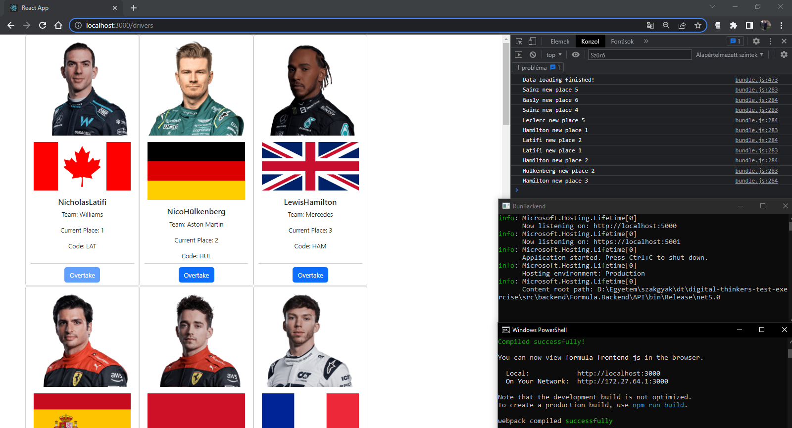

# Digital Thinkers Test Exercise
This is a fullstack web application displaying and mutating information about Formula 1 drivers. 

Author: **Csongor Vass**

# Build 
On Windows you can simply run the program by executing the `RunBackend.exe` and *then* the `FirstRunFrontend.cmd` files. If both finished building, you can go to `localhost:3000/drivers` and use the program. Later you can use the `RunFrontend.cmd` as well.

If you are using Linux or the shortcuts don't work, go to `src\backend\Formula.Backend\API\bin\Release\net5.0` and run `API.exe`, then go to `src\frontend\formula-frontend-js` and run the `npm install` then `npm start` commands.

If the backend is still not working, open it in Visual Studio and build and run the API project. 

> **Note**: If you run the backend from vs, you might need to change `API\\Static\\drivers.json` to `src\\backend\\Formula.Backend\\API\\Static\\drivers.json` in line 32 of FormulaContext.cs

# Solved tasks
* All backend requirements implemented in ASP.NET (instead of Node.js and Express as discussed)
* All frontend requirements (in simple JavaScript due to lack of TypeScript experience in React)
* Build and run without errors
* Frequent commits
* Logging data status to frontend console
* Styling with React Bootstrap
* Extra feature: Flag of driver's home country

# Screenshot

